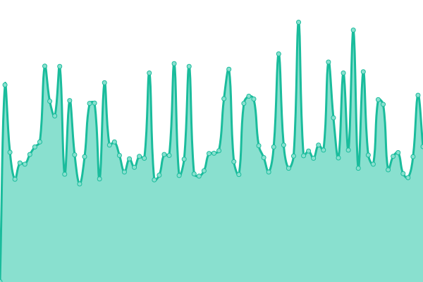
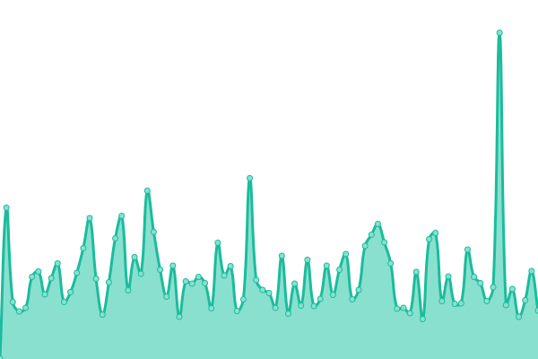
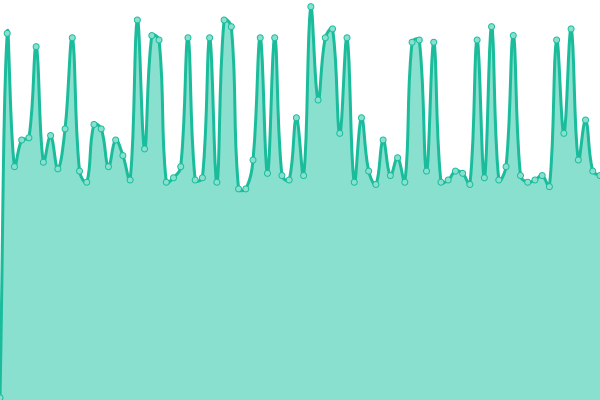
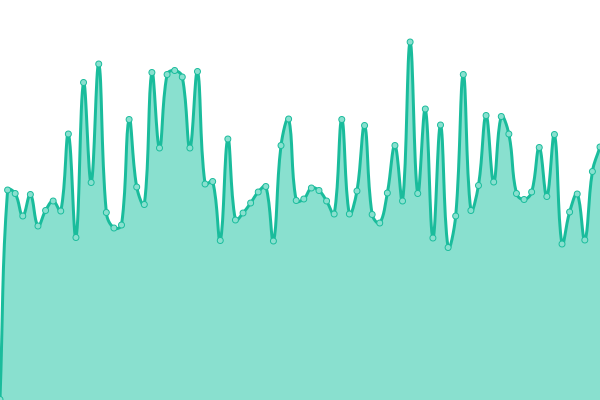
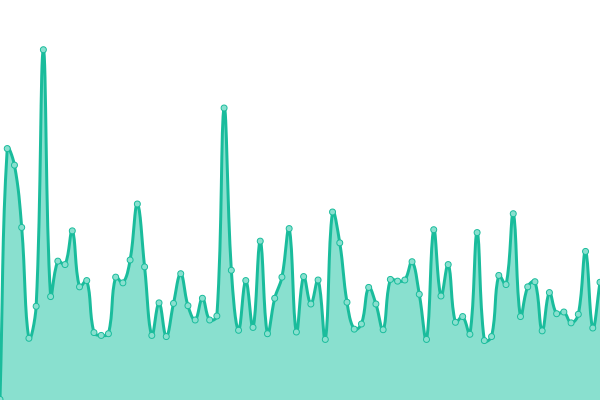
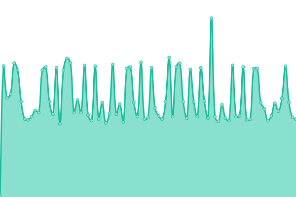
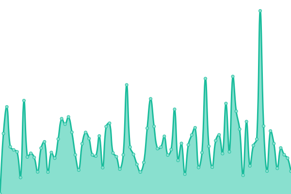
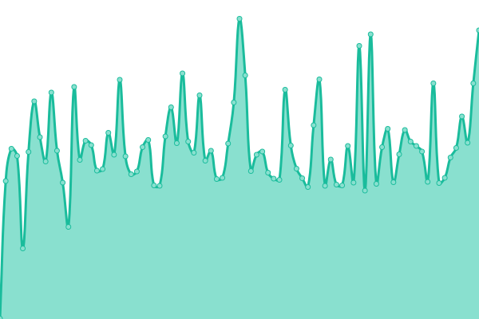
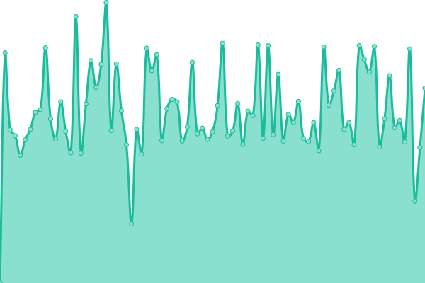
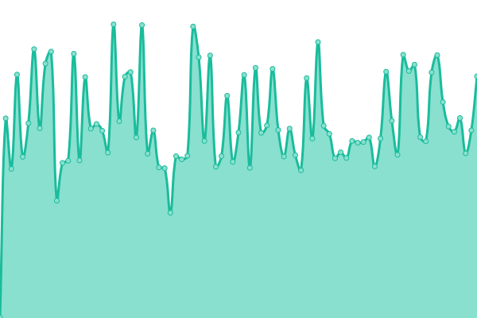

# [📈 Live Status](https://status.wireway.ch): <!--live status--> **🟧 Partial outage**

This repository contains the open-source uptime monitor and status page for [wirewayproject](https://status.wireway.ch), powered by [Upptime](https://github.com/upptime/upptime).

With [Upptime](https://upptime.js.org), you can get your own unlimited and free uptime monitor and status page, powered entirely by a GitHub repository. We use [Issues](https://github.com/wirewayproject/upptime/issues) as incident reports, [Actions](https://github.com/wirewayproject/upptime/actions) as uptime monitors, and [Pages](https://status.wireway.ch) for the status page.

<!--start: status pages-->
<!-- This summary is generated by Upptime (https://github.com/upptime/upptime) -->
<!-- Do not edit this manually, your changes will be overwritten -->
<!-- prettier-ignore -->
| URL | Status | History | Response Time | Uptime |
| --- | ------ | ------- | ------------- | ------ |
|  [Proxy](https://wireway.ch/api/status/nodes/?node=1) | 🟩 Up | [proxy.yml](https://github.com/wirewayproject/upptime/commits/HEAD/history/proxy.yml) | 

 438ms
     
 | 

<a href="https://status.wireway.ch/history/proxy">100.00%</a>
    

|  [r-place.ch](https://r-place.ch) | 🟩 Up | [r-place-ch.yml](https://github.com/wirewayproject/upptime/commits/HEAD/history/r-place-ch.yml) | 

 765ms
     
 | 

<a href="https://status.wireway.ch/history/r-place-ch">100.00%</a>
    

|  [Wireway Website](https://wireway.ch) | 🟩 Up | [wireway-website.yml](https://github.com/wirewayproject/upptime/commits/HEAD/history/wireway-website.yml) | 

 121ms
     
 | 

<a href="https://status.wireway.ch/history/wireway-website">100.00%</a>
    

|  [Wireway Speedtest](https://speedtest.wireway.ch) | 🟥 Down | [wireway-speedtest.yml](https://github.com/wirewayproject/upptime/commits/HEAD/history/wireway-speedtest.yml) | 

 0ms
     
 | 

<a href="https://status.wireway.ch/history/wireway-speedtest">0.00%</a>
    

|  [Wireway Autoajax](https://autoajax.wireway.ch) | 🟩 Up | [wireway-autoajax.yml](https://github.com/wirewayproject/upptime/commits/HEAD/history/wireway-autoajax.yml) | 

 405ms
     
 | 

<a href="https://status.wireway.ch/history/wireway-autoajax">100.00%</a>
    

|  [Wireway CLI](https://wireway.ch/cli.html) | 🟩 Up | [wireway-cli.yml](https://github.com/wirewayproject/upptime/commits/HEAD/history/wireway-cli.yml) | 

 123ms
     
 | 

<a href="https://status.wireway.ch/history/wireway-cli">100.00%</a>
    

|  [Cloud](https://cloud.bubicloud.ch) | 🟩 Up | [cloud.yml](https://github.com/wirewayproject/upptime/commits/HEAD/history/cloud.yml) | 

 110ms
     
 | 

<a href="https://status.wireway.ch/history/cloud">100.00%</a>
    

|  [Epilogue](https://epilogue.social) | 🟩 Up | [epilogue.yml](https://github.com/wirewayproject/upptime/commits/HEAD/history/epilogue.yml) | 

 524ms
     
 | 

<a href="https://status.wireway.ch/history/epilogue">100.00%</a>
    

|  [Piped Frontend](https://piped.wireway.ch) | 🟥 Down | [piped-frontend.yml](https://github.com/wirewayproject/upptime/commits/HEAD/history/piped-frontend.yml) | 

 400ms
     
 | 

<a href="https://status.wireway.ch/history/piped-frontend">0.00%</a>
    

|  [Piped Proxy](https://pipedproxy.wireway.ch) | 🟥 Down | [piped-proxy.yml](https://github.com/wirewayproject/upptime/commits/HEAD/history/piped-proxy.yml) | 

 396ms
     
 | 

<a href="https://status.wireway.ch/history/piped-proxy">0.00%</a>
    

|  [Piped API](https://pipedapi.wireway.ch) | 🟥 Down | [piped-api.yml](https://github.com/wirewayproject/upptime/commits/HEAD/history/piped-api.yml) | 

 400ms
     
 | 

<a href="https://status.wireway.ch/history/piped-api">0.00%</a>
    

<!--end: status pages-->

[**Visit our status website →**](https://status.wireway.ch)

## 📄 License

- Powered by: [Upptime](https://github.com/upptime/upptime)
- Code: [MIT](./LICENSE) © [Anand Chowdhary](https://anandchowdhary.com), supported by [Pabio](https://pabio.com)
- Data in the `./history` directory: [Open Database License](https://opendatacommons.org/licenses/odbl/1-0/)
